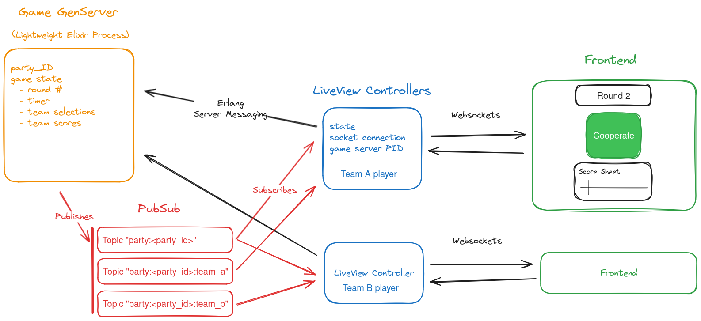

# JoinMy.Party

An interactive party platform where players connect from their smartphones to play in games together.

## Architecture

Each game room has the following architecture (using the game "Prisoner's Dilemma" in this example):

Players can create or join existing rooms using a unique Party ID. Once joined, their LiveView controller is able to interact with the game server using erlang server messaging, to send events, such as when a player clicks the button to change the team's selection in Prisoner's Dilemma.

The game server is the source of all state in the game. When changes are made to the state, either by timer events (ex: round ending) or player events (ex: changing a selection), the game server can use PubSub to broadcast relevant changes for the player LiveView's to update, such as to tell all players on a team if their selection was changed, or to tell all players that a round has ended and what the results of the round were. The LiveView can then push the DOM changes to player clients via websockets.

Since we are using Elixir and each game room is in its own process, this can scale horizontally to easily handle thousands of game rooms running concurrently, and entirely fault tolerant from each other.

## Available Games

Currently, the only game available is Prisoner's Dilemma.

## Start Dev Environment

  * Install dependencies with `mix deps.get`
  * Create and migrate your database with `mix ecto.setup`
  * Start PostgreSQL database with `start-docker-db.sh`
  * Start Phoenix endpoint with `mix phx.server` or inside IEx with `iex -S mix phx.server`

Now you can visit [`localhost:4000`](http://localhost:4000) from your browser.

## Run in Production

Ready to run in production? Please [check the Pheonix deployment guides](https://hexdocs.pm/phoenix/deployment.html).

